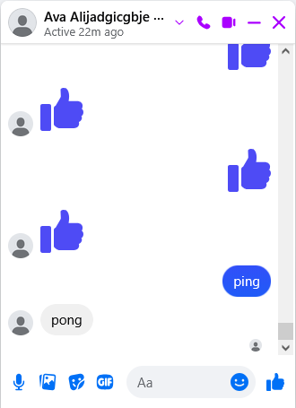

# Unofficial Facebook Messenger API

<a href="https://www.npmjs.com/package/meta-messenger.js"></a>
<a href="https://www.npmjs.com/package/meta-messenger.js"></a>

[](https://discord.gg/AbT6f9RMDe)

> [!TIP]
> **[Dự án này đã được di chuyển tới đây](https://github.com/yumi-team/meta-messenger.js). Kho lưu trữ gốc sẽ được lưu trữ (kỉ niệm).**

Facebook hiện có API chính thức cho chat bots [tại đây](https://developers.facebook.com/docs/messenger-platform).

API này là một trong những cách để tự động hóa các chức năng chat trên tài khoản người dùng. 
Sử dụng thư viện [mautrix-meta](https://github.com/mautrix/meta) (Go) thông qua FFI binding, thư viện này hỗ trợ (gần như) đầy đủ các tính năng mà thư viện gốc đã triển khai thông qua API JavaScript cấp cao.

> [!CAUTION]
> **Việc sử dụng tính năng này trên tài khoản người dùng bị cấm theo Điều khoản dịch vụ của Meta và có thể dẫn đến việc tài khoản bị khóa.**
> **Tôi không chịu trách nhiệm đối với bất kỳ tài khoản Meta nào bị khóa do sử dụng thư viện này.**

## Cài đặt
```bash
npm install meta-messenger.js
```

### Yêu cầu
- Node.js >= 22
- Cookies từ tài khoản Facebook/Messenger đã đăng nhập

## Ví dụ sử dụng
```typescript
import { Client, Utils } from 'meta-messenger.js'
import { readFileSync } from 'fs'

// Đọc cookies từ file (hỗ trợ nhiều định dạng)
const cookies = Utils.parseCookies(readFileSync('cookies.json', 'utf-8'))

// Tạo client mới
const client = new Client(cookies)

// Lắng nghe sự kiện
client.on('message', async (message) => {
    console.log(`Tin nhắn từ ${message.senderId}: ${message.text}`)
    
    // Echo bot đơn giản
    if (message.text === 'ping') {
        await client.sendMessage(message.threadId, 'pong')
    }
})

// Kết nối
await client.connect()
console.log(`Đã đăng nhập: ${client.user?.name}`)
```



## [Tài liệu](DOCS_VI.md)

## Chức năng chính

### Gửi tin nhắn
```typescript
// Tin nhắn đơn giản
await client.sendMessage(threadId, 'Xin chào!')

// Tin nhắn với reply
await client.sendMessage(threadId, {
    text: 'Đây là reply',
    replyToId: 'mid.xxx'
})

// Tin nhắn với mention
await client.sendMessage(threadId, {
    text: 'Chào @bạn!',
    mentions: [{ userId: 123456, offset: 5, length: 4 }]
})
```

### Gửi media
```typescript
import { readFileSync } from 'fs'

// Gửi ảnh
const image = readFileSync('photo.jpg')
await client.sendImage(threadId, image, 'photo.jpg', 'Caption đây')

// Gửi video
const video = readFileSync('video.mp4')
await client.sendVideo(threadId, video, 'video.mp4')

// Gửi sticker
await client.sendSticker(threadId, 369239263222822) // thumbs up
```

### Lưu E2EE State

Để lưu trạng thái E2EE cho lần sử dụng sau, bạn nên lưu device data vào file:

```typescript
import { writeFileSync, readFileSync } from 'fs'

// Lưu device data khi có thay đổi
client.on('deviceDataChanged', ({ deviceData }) => {
    writeFileSync('device.json', deviceData)
})

// Load device data khi khởi động
const deviceData = readFileSync('device.json', 'utf-8')
const client = new Client(cookies, { deviceData })
```

### Lắng nghe tin nhắn

```typescript
client.on('message', (message) => {
    console.log(`[${message.threadId}] ${message.senderId}: ${message.text}`)
    
    // Xử lý attachments
    for (const att of message.attachments || []) {
        if (att.type === 'image') {
            console.log(`  Ảnh: ${att.url}`)
        } else if (att.type === 'sticker') {
            console.log(`  Sticker: ${att.stickerId}`)
        }
    }
})

// E2EE messages
client.on('e2eeMessage', (message) => {
    console.log(`[E2EE] ${message.senderJid}: ${message.text}`)
})
```

## Định dạng Cookies hỗ trợ

API hỗ trợ nhiều định dạng cookies thông qua `Utils.parseCookies()`:

1. **C3C UFC Utility / EditThisCookie**
2. **Object đơn giản**
3. **Cookie header string**
4. **Netscape cookie file format**
5. **Base64 encoded** (bất kỳ định dạng nào ở trên)

Cookies bắt buộc: `c_user`, `xs` (các cookie khác như `datr`, `fr` là tùy chọn)

## FAQs

1. **Làm sao để lấy cookies?**
> Đăng nhập Facebook trên trình duyệt, mở DevTools (F12), vào tab Application > Cookies, copy các giá trị `c_user`, `xs` (và tùy chọn `datr`, `fr`).

2. **Tại sao tôi không nhận được tin nhắn E2EE?**
> Đảm bảo bạn đã enable E2EE với `enableE2EE: true` và đợi event `fullyReady` trước khi xử lý tin nhắn.

3. **Sự khác biệt giữa event message và e2eeMessage?**
> - `message`: Tin nhắn thường, metadata visible với Facebook
> - `e2eeMessage`: Tin nhắn mã hóa đầu cuối, chỉ sender và receiver đọc được

4. **Tại sao cần đợi fullyReady?**
> Event `fullyReady` được emit khi cả socket và E2EE (nếu enabled) đã sẵn sàng. Nếu xử lý tin nhắn trước đó, bạn có thể miss một số tin nhắn E2EE.

## License

GNU Affero General Public License v3.0

Theo License của mautrix-meta

## Credits

- Claude Opus 4.5 - Hỗ trợ đọc hiểu và xây dựng thư viện này
- [mautrix-meta](https://github.com/mautrix/meta) - A Matrix-Facebook Messenger and Instagram DM puppeting bridge.
- [whatsmeow](https://github.com/tulir/whatsmeow) - Go library for the WhatsApp web multidevice API
- [facebook-chat-api](https://github.com/Schmavery/facebook-chat-api) - Truyền cảm hứng cho API Style
- [whatsmeow-node](https://github.com/vinikjkkj/whatsmeow-node) - Tham khảo cách viết thư viện NodeJS với FFI.
- [koffi](https://codeberg.org/Koromix/rygel/src/branch/master/src/koffi) - Fast and easy-to-use C FFI module for Node.js
- [imhiendev/LoginFacebookAppKatanaAPI](https://github.com/imhiendev/LoginFacebookAppKatanaAPI) - Mã nguồn code login vào tài khoản Facebook

## Tuyên bố miễn trừ trách nhiệm

> Tất cả tên sản phẩm và công ty là nhãn hiệu™ hoặc nhãn hiệu đã đăng ký® của chủ sở hữu tương ứng. Việc sử dụng chúng không ngụ ý bất kỳ sự liên kết hoặc chứng thực nào từ họ.
> "Facebook", "Messenger", "Meta", "Instagram" là nhãn hiệu đã đăng ký của Meta, Inc., được sử dụng theo thỏa thuận cấp phép.
